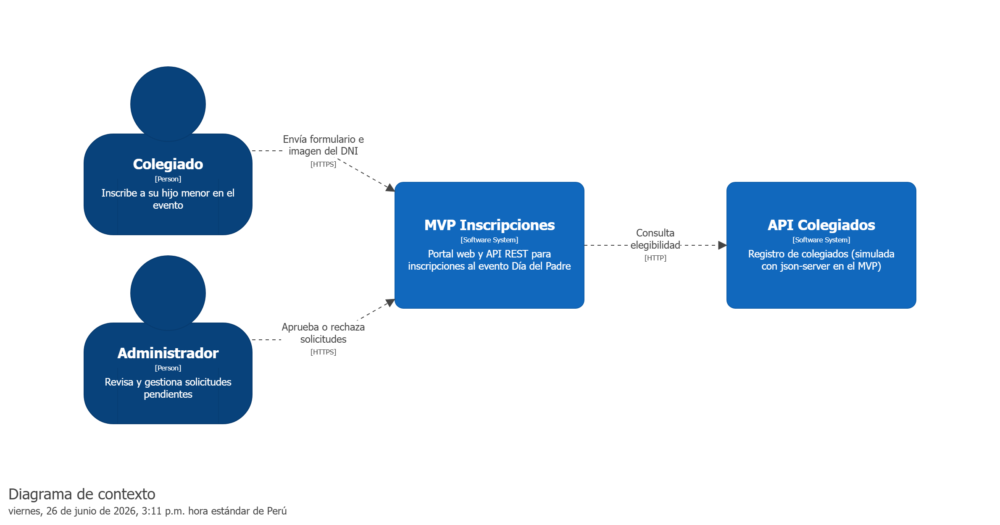
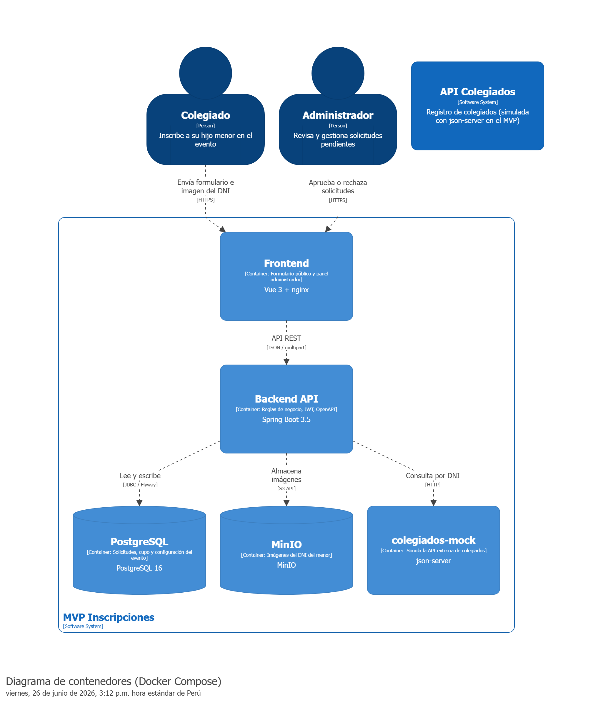
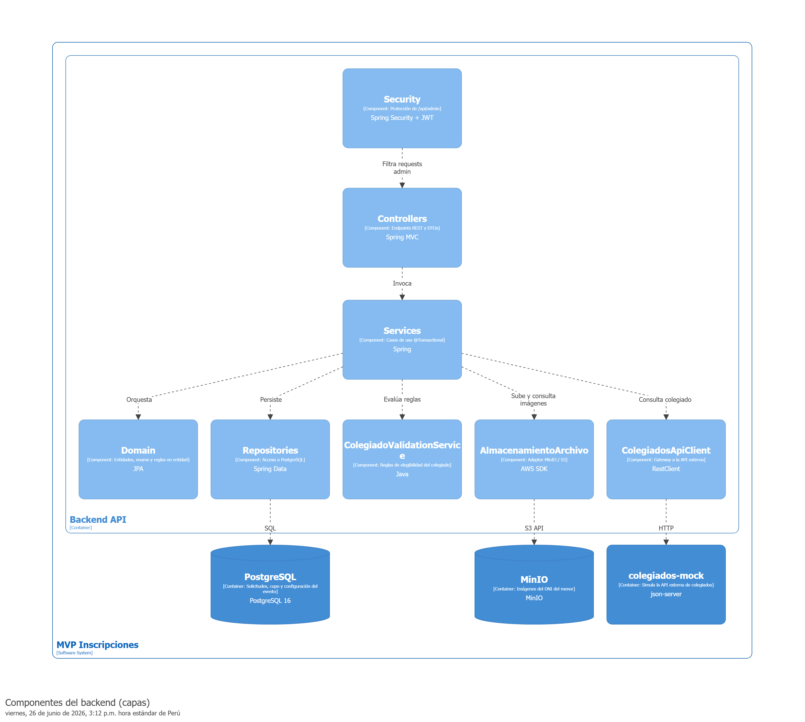
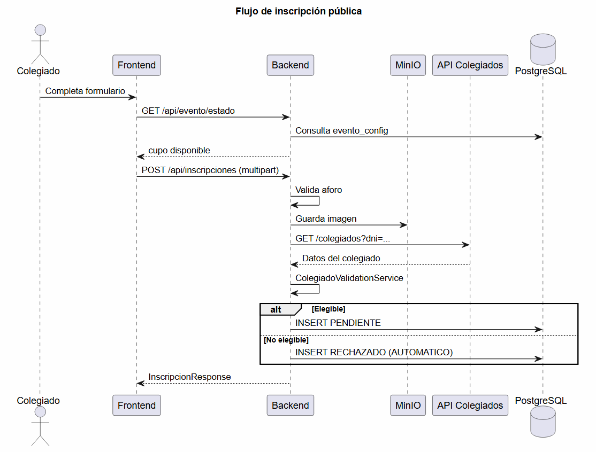
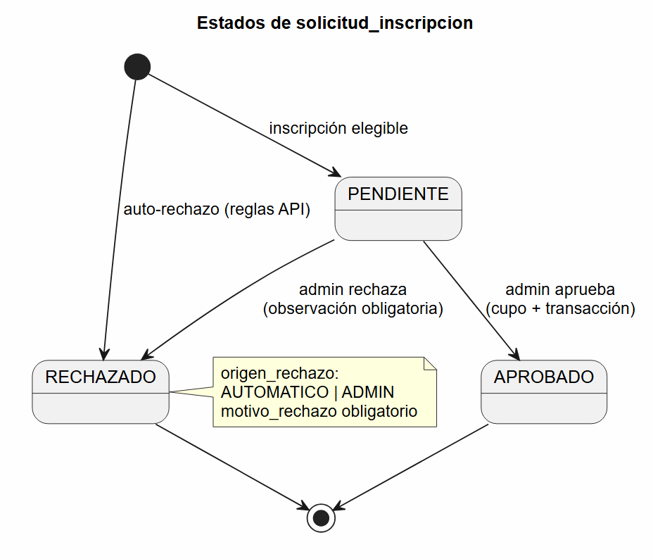

# MVP Inscripciones — Evento Dia del Padre (CIP Lima)

Monorepo con backend REST, frontend Vue 3 y orquestacion Docker para gestionar inscripciones al evento institucional del Consejo Departamental de Lima. El diseño concentra el esfuerzo en reglas de negocio, consistencia del flujo de datos y concurrencia del cupo de aforo.

Repositorio: [github.com/johaanq/cip-lima-mvp-inscripciones](https://github.com/johaanq/cip-lima-mvp-inscripciones)

---

## Alcance y prioridades del MVP

Sistema minimo viable para inscripciones con validacion externa de colegiados, revision administrativa y control estricto de aforo. Las prioridades de implementacion fueron:

1. **Flujo de datos** — validacion, persistencia y transiciones de estado (PENDIENTE, APROBADO, RECHAZADO).
2. **Reglas de negocio** — elegibilidad del colegiado, auto-rechazos trazables y bloqueo por aforo.
3. **Persistencia versionada** — esquema con Flyway y constraints en PostgreSQL.
4. **Concurrencia en cupos** — aprobaciones simultaneas sin sobreventa.
5. **Despliegue reproducible** — stack completo con `docker compose up`.
6. **Commits incrementales** — entregas en piezas pequeñas y revisables.

La logica de negocio, transacciones y pruebas unitarias viven en el backend. El frontend cubre el portal de inscripcion y el panel administrador; el historial por pestañas y la carga de imagenes con vista previa son mejoras de usabilidad sobre la interfaz funcional base.

| Area | Enfoque |
|------|---------|
| Reglas de negocio | ColegiadoValidationService con reglas aisladas; auto-rechazos persistidos |
| Flujo de datos | Toda solicitud enviada queda registrada en BD, incluidos rechazos automaticos |
| Concurrencia de aforo | UPDATE condicional en la misma transaccion que la aprobacion |
| Infraestructura | Postgres, mock json-server, MinIO, backend y frontend en un solo compose |
| Documentacion | ADRs, diagramas C4, persistencia y estrategia de concurrencia |
| Interfaz | Vue 3: formulario, dashboard, metricas e historial de solicitudes |

---

## Requisitos previos

- Docker Desktop 4.x o superior
- Docker Compose v2
- (Opcional) Java 17 y Node.js 22+ para desarrollo local sin contenedores

---

## Arranque en un comando

Copia la configuracion de entorno antes de levantar el stack (obligatorio):

```bash
cp .env.example .env
docker compose up --build
```

Todas las variables de servicios y puertos viven en `.env`. El archivo `docker-compose.yml` solo define servicios, dependencias y el mapeo de puertos; no duplica valores por defecto.

Para reiniciar desde cero (incluye volumenes de datos):

```bash
docker compose down -v
docker compose up --build
```

Docker Compose arranca el backend solo cuando PostgreSQL, MinIO y el mock de colegiados estan **healthy** (healthchecks configurados en `docker-compose.yml`). No hace falta ningun paso manual adicional.

---

## URLs y servicios

| Servicio | URL | Notas |
|----------|-----|-------|
| Portal de inscripcion | http://localhost | Frontend (nginx) |
| Panel administrador | http://localhost/admin/login | Requiere JWT |
| API REST | http://localhost:8080/api | Backend Spring Boot |
| Swagger UI | http://localhost:8080/swagger-ui/index.html | Documentacion OpenAPI |
| MinIO consola | http://localhost:9001 | Usuario/clave en .env.example |
| Mock colegiados | Red interna Docker (colegiados-mock:3001) | No expuesto al host |

El frontend en nginx proxya `/api` hacia el backend, asi que las peticiones del navegador pueden usar rutas relativas `/api/...`.

---

## Credenciales por defecto

### PostgreSQL

| Variable | Valor |
|----------|-------|
| Base de datos | inscripciones |
| Usuario | postgres |
| Contraseña | postgres |
| Host (desde host) | localhost:5432 no expuesto; solo red Docker |

### Administrador de la aplicacion

| Campo | Valor |
|-------|-------|
| Usuario | admin |
| Contraseña | admin123 |

El usuario admin se crea en PostgreSQL al primer arranque si la tabla admin_usuario esta vacia (contraseña hasheada con BCrypt).

### MinIO

| Campo | Valor |
|-------|-------|
| Access key | minioadmin |
| Secret key | minioadmin |
| Bucket | inscripciones-imagenes |

Todas las variables estan documentadas en `.env.example`. No commitear el archivo `.env` con secretos reales.

---

## Arquitectura del sistema

La arquitectura se documento con diagramas C4 (Structurizr) y secuencia UML (PlantUML). Las capturas estan en `docs/diagrams/`.

### Diagrama de contexto



### Vista de contenedores



### Componentes del backend



El backend sigue arquitectura en capas: el dominio es acotado (inscripcion, cupo, elegibilidad) y el objetivo fue mantener transacciones claras y codigo legible, sin la complejidad de un DDD completo en este alcance.

Capas: **Controllers + DTOs** → **Services (@Transactional)** → **Domain (entidades JPA, enums)** → **Infraestructura (repos, HTTP client, MinIO)**.

### Estructura del monorepo

```text
cip-lima-mvp-inscripciones/
├── backend/              # Java 17, Spring Boot 3.5.16
├── frontend/             # Vue 3 + Vite
├── mock/db.json          # Datos del mock de colegiados
├── docker-compose.yml
├── .env.example
└── README.md
```

### Patrones aplicados

| Patron | Donde | Para que |
|--------|-------|----------|
| Layered Architecture | Paquetes controller, service, domain, repository | Separar responsabilidades |
| Repository | SolicitudRepository, EventoConfigRepository | Abstraer persistencia |
| Service Layer | InscripcionService, AdminSolicitudService | Casos de uso y transacciones |
| DTO | Records en dto/ | No exponer entidades JPA en la API |
| Gateway / Client | ColegiadosApiClient | Aislar la API externa simulada |
| Strategy (ligero) | ColegiadoValidationService | Reglas de elegibilidad extensibles |
| Adapter | AWS SDK S3 → MinIO | Mismo patron que S3 en produccion |

### Flujo de inscripcion publica



1. El frontend consulta `GET /api/evento/estado` para verificar aforo.
2. El usuario envia `POST /api/inscripciones` (multipart: DNIs, nombre, imagen).
3. El backend valida aforo, sube la imagen a MinIO y consulta el mock de colegiados.
4. ColegiadoValidationService evalua las reglas; resultado PENDIENTE o RECHAZADO (automatico) persistido en PostgreSQL.

### Flujo de aprobacion administrativa

1. El admin inicia sesion y obtiene JWT.
2. Consulta metricas y solicitudes pendientes.
3. Al aprobar, en **una sola transaccion**: incremento condicional de cupo + estado APROBADO + log de invitacion simulado.
4. Al rechazar, observacion obligatoria, estado RECHAZADO con origen_rechazo=ADMIN + log de alerta simulado.

---

## Decisiones tecnicas (stack)

| Capa | Eleccion | Motivo |
|------|----------|--------|
| Backend | Java 17 + Spring Boot 3.5.16 | Transacciones declarativas, ecosistema maduro, capas claras |
| Base de datos | PostgreSQL 16 | ACID, constraints, adecuada para concurrencia de cupos |
| Migraciones | Flyway (V1__init_schema.sql) | Esquema versionado desde el arranque |
| Mock colegiados | json-server en Docker | Servicio mock independiente, sin codigo custom en el backend |
| Imagenes | MinIO (API S3) | Object storage on-premise; en produccion solo cambia el endpoint |
| Seguridad admin | Spring Security + JWT stateless | Proteccion de /api/admin/** sin sesion en servidor |
| Documentacion API | SpringDoc OpenAPI 3 | Contrato visible; esquema Bearer JWT |
| Frontend | Vue 3 + Vite | SPA minima: formulario + dashboard |
| Orquestacion | Docker Compose | Un comando levanta todo el stack |

---

## Decisiones arquitectonicas (ADR)

### ADR-001: Capas en lugar de DDD completo

**Contexto:** Dominio pequeño (inscripcion, cupo, validacion de colegiado) y tiempo acotado.

**Decision:** Capas (controller → service → domain/repository → infra) con reglas en servicios y metodos de entidad.

**Consecuencias:** Menos overhead y codigo directo. Si el dominio crece, se pueden extraer agregados despues.

### ADR-002: Persistir auto-rechazos como RECHAZADO

**Contexto:** Una inscripcion no elegible puede descartarse o persistirse.

**Decision:** Toda solicitud enviada se guarda. Los rechazos automaticos quedan en RECHAZADO con origen_rechazo=AUTOMATICO y motivo explicito.

**Consecuencias:** Metricas del dashboard coherentes, trazabilidad y flujo de datos estable (siempre hay registro en BD).

### ADR-003: Concurrencia de cupos con UPDATE condicional

**Contexto:** Varios administradores podrian aprobar a la vez con cupo limitado (10 plazas).

**Decision:** En la misma transaccion de aprobacion:

```sql
UPDATE evento_config
SET cupo_ocupado = cupo_ocupado + 1
WHERE id = 1 AND cupo_ocupado < cupo_maximo;
```

Si rows affected = 0, no se aprueba la solicitud (HTTP 409). El cupo solo incrementa al aprobar, nunca al inscribirse.

**Consecuencias:** Evita sobreventa sin bloqueo pesimista explicito; suficiente para el volumen del MVP.

### ADR-004: MinIO para imagenes

**Contexto:** Las imagenes del DNI del menor no deben ir en la BD.

**Decision:** MinIO en Docker con AWS SDK (path-style). La clave del objeto va en imagen_object_key.

**Consecuencias:** Mismo patron que S3 en produccion; el bucket se crea al arranque si no existe.

### ADR-005: JWT en memoria (frontend) y Spring Security (backend)

**Contexto:** El panel admin necesita autenticacion stateless.

**Decision:** Login via `POST /api/auth/login`; token JWT solo en memoria del SPA (no localStorage). Filtro JWT en Spring Security para `/api/admin/**`.

**Consecuencias:** Menor riesgo de XSS persistente; el token se pierde al cerrar pestaña, aceptable para este MVP.

### ADR-006: SpringDoc OpenAPI con Bearer auth

**Contexto:** Facilitar pruebas manuales de los endpoints administrativos.

**Decision:** SpringDoc en `/swagger-ui/index.html` con esquema bearerAuth en operaciones administrativas.

**Consecuencias:** Documentacion alineada al codigo y facil de probar desde el navegador.

---

## Persistencia

### Migraciones Flyway

- Ubicacion: `backend/src/main/resources/db/migration/`
- Estrategia JPA: `ddl-auto: validate` (el esquema lo define Flyway, no Hibernate)

### Tablas

**evento_config** (singleton, id = 1)

| Columna | Descripcion |
|---------|-------------|
| cupo_maximo | Aforo estricto (10 en el MVP) |
| cupo_ocupado | Incrementa solo al aprobar |
| sede_consejo | Consejo territorial del evento (Lima) |

**admin_usuario**

| Columna | Descripcion |
|---------|-------------|
| username | Login del administrador |
| password_hash | Contraseña BCrypt |
| activo | Si el usuario puede autenticarse |

Al primer arranque se inserta admin si la tabla esta vacia.

**solicitud_inscripcion**

| Columna | Descripcion |
|---------|-------------|
| dni_colegiado, nombre_colegiado, dni_menor | Datos del formulario |
| imagen_object_key | Referencia al objeto en MinIO |
| estado | PENDIENTE, APROBADO, RECHAZADO |
| motivo_rechazo | Obligatorio si RECHAZADO (CHECK en BD) |
| origen_rechazo | AUTOMATICO o ADMIN |
| created_at, updated_at | Trazabilidad |

Indices: estado, dni_colegiado, created_at DESC.

### Maquina de estados



Transiciones: inscripcion elegible → PENDIENTE; auto-rechazo → RECHAZADO; admin aprueba → APROBADO; admin rechaza → RECHAZADO con observacion obligatoria.

---

## Concurrencia y aforo

### Bloqueo en nuevas inscripciones

Antes de registrar, InscripcionService consulta evento_config. Si cupo_ocupado >= cupo_maximo, lanza AforoCompletoException (HTTP 409). Las solicitudes en PENDIENTE no consumen cupo hasta ser aprobadas.

### Aprobacion concurrente

Pseudocodigo del caso de uso:

```text
@Transactional
aprobar(solicitudId):
  solicitud = buscar(solicitudId)
  filas = UPDATE evento_config SET cupo_ocupado = cupo_ocupado + 1
          WHERE id = 1 AND cupo_ocupado < cupo_maximo
  si filas == 0 → error "No hay cupo disponible"
  solicitud.aprobar()
  guardar(solicitud)
  notificarInvitacion(solicitud)  // log simulado
```

Implementacion en EventoConfigRepository.incrementarCupoSiDisponible.

---

## Reglas de negocio

Evaluadas contra la API mock de colegiados al momento de inscribirse:

| Criterio | Condicion | Resultado |
|----------|-----------|-----------|
| Colegiado registrado | DNI existe en API mock | Si no existe → RECHAZADO automatico |
| Estado habilitado | habilitado: true | Si false → RECHAZADO automatico |
| Pertenencia territorial | consejo_departamental = sede del evento (Lima) | Si distinto → RECHAZADO automatico |
| Restriccion laboral | es_administrativo: false | Si true → RECHAZADO automatico |
| Aforo disponible | cupo_ocupado < cupo_maximo | Si lleno → HTTP 409 (no persiste) |
| Elegible | Pasa todas las reglas | PENDIENTE (revision admin) |

**Acciones del administrador (solo sobre PENDIENTE):**

- **Aprobar:** consume cupo, estado APROBADO, log de invitacion.
- **Rechazar:** observacion obligatoria, estado RECHAZADO, origen_rechazo=ADMIN, log de alerta.

---

## API mock de colegiados

El servicio colegiados-mock (json-server) expone `GET /colegiados?dni={dni}` desde mock/db.json.

Los datos del mock estan en mock/db.json. Tras editarlo, json-server con `--watch` recarga el archivo; en Windows, si el cambio no se refleja, reinicia el servicio con `docker compose restart colegiados-mock`.

El backend (ColegiadosApiClient) consulta el listado filtrado por DNI y toma el registro coincidente, sin depender de rutas custom de json-server.

URL interna Docker: http://colegiados-mock:3001 (variable COLEGIADOS_API_URL).

---

## Datos de prueba

| DNI | Nombre | Resultado esperado al inscribirse | Motivo |
|-----|--------|-----------------------------------|--------|
| 12345678 | Juan Perez | PENDIENTE | Elegible (Lima, habilitado, no admin) |
| 87654321 | Maria Lopez | RECHAZADO | Personal administrativo |
| 11223344 | Carlos Ruiz | RECHAZADO | No habilitado |
| 44332211 | Ana Gomez | RECHAZADO | Consejo distinto de Lima |
| 99887766 | Pedro Infante | PENDIENTE | Elegible (caso adicional) |

Para probar aforo completo: aprobar 10 solicitudes pendientes; la inscripcion 11 debe recibir error de aforo.

---

## Seguridad

| Aspecto | Implementacion |
|---------|----------------|
| Rutas publicas | /api/inscripciones, /api/evento/**, /api/auth/login, /api/health, Swagger |
| Rutas protegidas | /api/admin/** (rol ADMIN) |
| JWT | Configuracion en application.yml (app.jwt.secret, app.jwt.expiration-ms) |
| Usuario admin | Tabla admin_usuario en PostgreSQL; seed admin / admin123 al primer arranque |
| Contraseña admin | BCrypt; validacion con Spring Security |
| CORS | Origen explicito (CORS_ALLOWED_ORIGINS en .env) |
| Imagenes | Upload validado (tipo/tamano); lectura de imagen solo con JWT admin |
| Secretos de infra | PostgreSQL, MinIO y CORS en .env; .env.example sin valores de produccion |

---

## Swagger / OpenAPI

1. Abrir http://localhost:8080/swagger-ui/index.html
2. Ejecutar `POST /api/auth/login` con `{ "username": "admin", "password": "admin123" }`
3. Copiar el token de la respuesta
4. Pulsar **Authorize** e ingresar: `Bearer <token>`
5. Probar endpoints bajo tag **Administracion**

---

## API REST (resumen)

| Metodo | Ruta | Auth | Descripcion |
|--------|------|------|-------------|
| GET | /api/health | No | Health check |
| GET | /api/evento/estado | No | Cupo y aforo |
| POST | /api/inscripciones | No | Registro multipart |
| GET | /api/inscripciones/{id} | No | Consulta de solicitud |
| POST | /api/auth/login | No | Login admin → JWT |
| GET | /api/admin/metricas | JWT | Contadores del dashboard |
| GET | /api/admin/solicitudes/pendientes | JWT | Listado pendientes |
| GET | /api/admin/solicitudes/aprobadas | JWT | Historial de solicitudes aprobadas |
| GET | /api/admin/solicitudes/rechazadas | JWT | Historial de solicitudes rechazadas |
| GET | /api/admin/solicitudes/{id}/imagen | JWT | Stream imagen MinIO |
| POST | /api/admin/solicitudes/{id}/aprobar | JWT | Aprobar con cupo |
| POST | /api/admin/solicitudes/{id}/rechazar | JWT | Rechazar con observacion |

---

## Desarrollo local (sin Docker)

```bash
# Backend
cd backend
./mvnw spring-boot:run

# Frontend
cd frontend
npm install
npm run dev
```

Requiere PostgreSQL, MinIO y json-server en ejecucion con las URLs de `application.yml` / `.env`.

Tests del backend:

```bash
cd backend
./mvnw test
```

---

## Requisitos implementados

Capacidades del sistema respecto a los requerimientos funcionales del MVP:

| Requisito | Implementacion |
|-----------|----------------|
| Portal: DNI, nombre, imagen del menor, validacion contra API externa | InscripcionView.vue, POST /api/inscripciones |
| Elegible → estado PENDIENTE en BD | InscripcionService, SolicitudInscripcion.crearPendiente() |
| Dashboard con metricas agregadas | GET /api/admin/metricas, AdminDashboardView.vue |
| Listado de solicitudes PENDIENTE | GET /api/admin/solicitudes/pendientes |
| Aprobar: consume cupo e invitacion simulada (log) | AdminSolicitudService.aprobar(), NotificacionService |
| Rechazar: observacion obligatoria y alerta simulada (log) | RechazarSolicitudRequest, NotificacionService |
| Aforo maximo estricto; bloqueo de nuevas inscripciones | Cupo 10 en Flyway; HTTP 409 si lleno |
| Colegiado habilitado (habilitado: true) | ReglaColegiadoHabilitado |
| Pertenencia al consejo de la sede (Lima) | ReglaConsejoDepartamental |
| No personal administrativo (es_administrativo: false) | ReglaRestriccionAdministrativa |
| API mock independiente en Docker | Servicio colegiados-mock, mock/db.json |
| Persistencia formal (migraciones) | Flyway V1__init_schema.sql, V2__admin_usuario.sql |
| Arranque con docker compose up | docker-compose.yml (5 servicios) |

**Ampliaciones adicionales:** historial de aprobadas y rechazadas, Spring Security con JWT, almacenamiento en MinIO, documentacion OpenAPI, diagramas de arquitectura y tests unitarios de reglas de negocio.

**Notas de configuracion:** las imagenes no se guardan en PostgreSQL sino en MinIO; el usuario admin se seedea en BD con BCrypt; el secret JWT de desarrollo esta en application.yml (en produccion conviene externalizarlo).

---

## Limitaciones y mejoras futuras

- Refresh token y rotacion de JWT para sesiones admin mas largas
- Rate limiting en login y en inscripciones publicas
- Cola de correo real (SQS + SES o similar) en lugar de logs simulados
- Validacion estricta nombre formulario vs. nombre en API colegiados
- Tests de integracion con Testcontainers (PostgreSQL + MinIO)
- CI con GitHub Actions (build + tests en cada push)

---

## Atributos de calidad

| Atributo | Prioridad | Enfoque |
|----------|-----------|---------|
| Correctitud / reglas de negocio | Critica | Reglas aisladas, auto-rechazos persistidos, constraints SQL |
| Consistencia de datos | Critica | Transacciones @Transactional, update condicional de cupo |
| Trazabilidad | Alta | Flyway, origen_rechazo, timestamps, commits atomicos |
| Mantenibilidad | Alta | Capas, ADRs, OpenAPI |
| Seguridad | Alta | JWT, BCrypt, CORS, uploads validados |
| Disponibilidad | Media | Healthchecks en Docker Compose |
| Escalabilidad | Documentada | API stateless; BD y storage desacoplados |
